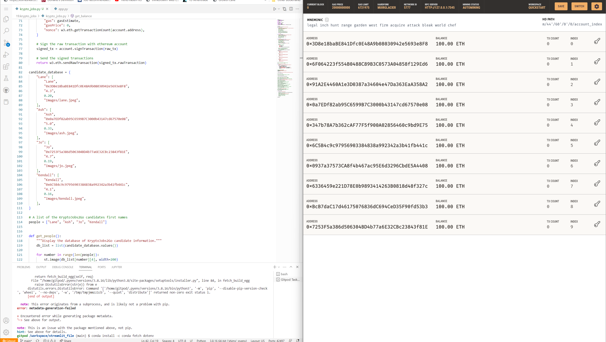

## Cryptocurrency Wallet

### Background

KryptoJobs2Go is an application that its customers can use to find fintech professionals from among a list of candidates, hire them, and pay them. As KryptoJobs2Go’s lead developer, I have been tasked with integrating the Ethereum blockchain network into the application in order to enable my customers to instantly pay the fintech professionals whom they hire with cryptocurrency.

I will complete the code that enables customers to send cryptocurrency payments to fintech professionals. To develop the code and test it out, I assumed the perspective of a KryptoJobs2Go customer who is using the application to find a fintech professional and pay them for their work.

### What I am Creating

To complete this Challenge, I will use two Python files

The first file is called `krypto_jobs.py`. It contains the code associated with the web interface of application. The code included in this file is compatible with the Streamlit library. 

The second file is called `crypto_wallet.py`. This file contains the Ethereum transaction functions. By using import statements, I will integrate the `crypto_wallet.py` Python script into the KryptoJobs2Go interface program that is found in the `krypto_jobs.py` file.

Integrating these two files will allow to automate the tasks associated with generating a digital wallet, accessing Ethereum account balances, and signing and sending transactions via a personal Ethereum blockchain called Ganache.

Specifically, I will assume the perspective of a KryptoJobs2Go customer in order to do the following:

* Generate a new Ethereum account instance by using the mnemonic seed phrase provided by Ganache.

* Fetch and display the account balance associated with the Ethereum account address.

* Calculate the total value of an Ethereum transaction, including the gas estimate, that pays a KryptoJobs2Go candidate for their work.

* Digitally sign a transaction that pays a KryptoJobs2Go candidate, and send this transaction to the Ganache blockchain.

* Review the transaction hash code associated with the validated blockchain transaction.

The steps for this challenge are broken out into the following sections:

* Import Ethereum Transaction Functions into the KryptoJobs2Go Application
* Sign and Execute a Payment Transaction
* Inspect the Transaction on Ganache

#### Step 1: Import Ethereum Transaction Functions into the KryptoJobs2Go Application

In this section, I will import several functions from the `crypto_wallet.py` script into the file `krypto_jobs.py`, which contains code for KryptoJobs2Go’s customer interface, in order to add wallet operations to the application. For this section, I will assume the perspective of a KryptoJobs2Go customer (i.e., I ll provide the Ethereum wallet and account information to the application).

Complete the following steps:

1. Review the code contained in the `crypto_wallet.py` script file. 

2. Add my mnemonic seed phrase (provided by Ganache) 

3. Within the Streamlit sidebar section of code, create a variable named `account`. Set this variable equal to a call on the `generate_account` function. This function will create the KryptoJobs2Go customer’s (in this case, will be mine) HD wallet and Ethereum account.

4. define a new `st.sidebar.write` function that will display the balance of the customer’s account.

#### Step 2: Sign and Execute a Payment Transaction

Next, I'll write the code that will calculate a fintech professional’s wage, in ether, based on the worker’s hourly rate and the number of hours that they work for a customer. (The fintech professionals’ hourly rates are provided in the `candidate_database` that is found in `krypto_jobs.py`.)

I will then write code that uses the calculated wage value to send a transaction that pays the worker. This code should allow the KryptoJobs2Go customer to authorize the transaction with their digital signature. For the purpose of testing out this application,  I used my own Ethereum account information as the customer account information.

To accomplish all of this, I will complete the following steps:

1. KryptoJobs2Go customers will select a fintech professional from the application interface’s drop-down menu, and then input the amount of time for which they’ll hire the worker. Code the application so that once a customer completes these steps, the application will calculate the amount that the worker will be paid in ether. To do so, complete the following steps:

    * Write the equation that calculates the candidate’s wage. This equation should assess the candidate’s hourly rate from the candidate database (`candidate_database[person][3]`) and then multiply this hourly rate by the value of the `hours` variable.

    * Write the `wage` variable to the Streamlit sidebar by using `st.sidebar.write`.

2. Now that the application can calculate a candidate’s wage, write the code that will allow a customer (I , in this case) to send an Ethereum blockchain transaction that pays the hired candidate. To accomplish this, I locate the code that reads `if st.sidebar.button("Send Transaction")`. I will need to add logic to this `if` statement that sends the appropriate information to the `send_transaction` function (which I imported from the `crypto_wallet` script file). Inside the `if` statement, I add the following functionality:

    * Call the `send_transaction` function and pass it three parameters:

    * My Ethereum `account` information. (Remember that this `account` instance was created when the `generate_account` function was called.) From the `account` instance, the application will be able to access the `account.address` information that is needed to populate the `from` data attribute in the raw transaction.

    * The `candidate_address` (which will be created and identified in the sidebar when a customer selects a candidate). This will populate the `to` data attribute in the raw transaction.

    * The `wage` value. This will be passed to the `toWei` function to determine the wei value of the payment in the raw transaction.

    * Save the transaction hash that the `send_transaction` function returns as a variable named `transaction_hash`, and have it display on the application’s web interface.

#### Step 3: Inspect the Transaction

Now it's time to put it all together and test the KryptoJobs2Go application with my newly integrated Ethereum wallet. I will send a test transaction by using the application’s web interface, and then look up the resulting transaction in Ganache. To do so, complete the following steps:

1. From my terminal, navigate to the project folder that contains my `.env` file and the `krypto_jobs.py` and `crypto_wallet.py` files.

2. Launch the Streamlit application from terminal

3. from there, I can test everything

## `because I runed through issues with my streamlit. here is the screanshot of my `ganache` and my `code``

